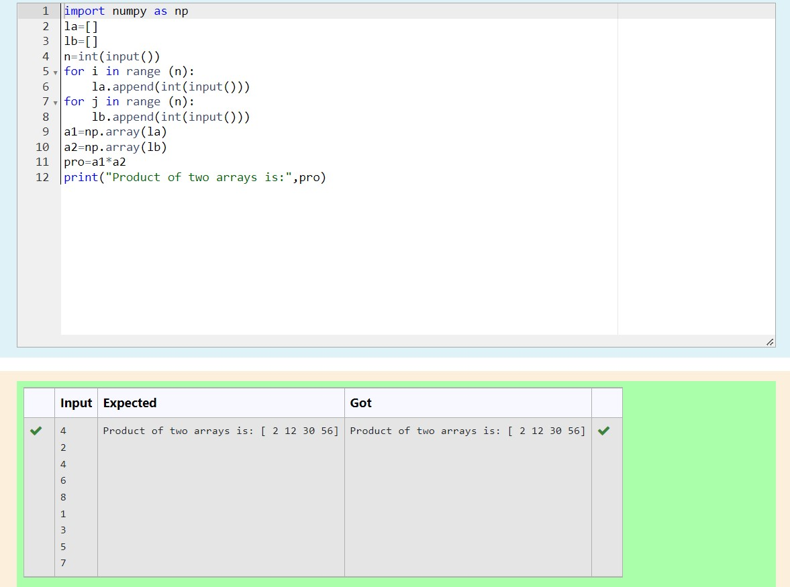

# Multiplying-two-matrix

## AIM:
To write a program to perform Multiplying-two-matrix using python programming.

## ALGORITHM:

### Step 1:
Import Numpy as np.

### Step 2:
Get input from the user.

### Step 3:
Create empty lists l1 and l2.

### Step 4:
Use for loop to append the values into the list created.

### Step 5:
Print the product of two arrays.

## PROGRAM: 
~~~
import numpy as np
la=[]
lb=[]
n=int(input())
for i in range (n):
    la.append(int(input()))
for j in range (n):
    lb.append(int(input()))
a1=np.array(la)
a2=np.array(lb)
pro=a1*a2
print("Product of two arrays is:",pro)
~~~
## OUTPUT:

## RESULT:
Thus the program is written to perform Multiplying-two-matrix using python programming.
